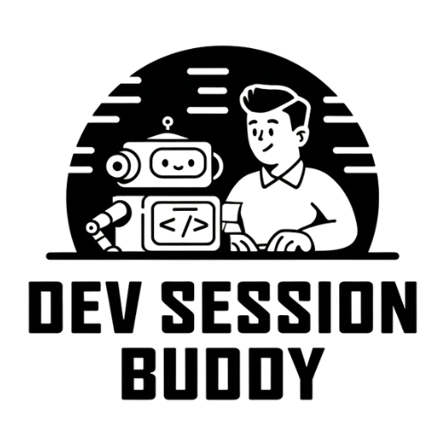

To https://github.com/codevalve/dev-session-buddy.git
 * [new branch]      main -> main
# Dev Session Buddy 🤝

  

Born from the experience of pair programming with AI assistants, Dev Session Buddy is a smart development session startup script that standardizes how project context, tooling, and development standards are communicated to both human and AI collaborators.

## Origin Story 📖

While working on a Vue.js project with AI pair programming assistants, we discovered the need to repeatedly explain project context, available tools, and development standards at the start of each session. This led to the creation of a comprehensive session startup script that could convey this information consistently to both human developers and AI assistants.

## Purpose 🎯

Dev Session Buddy aims to:
- Standardize project context sharing across development sessions
- Streamline onboarding for new team members (human and AI)
- Ensure consistent development practices
- Reduce repetitive explanation of project setup and standards
- Enhance collaboration between developers and AI assistants

## Features ✨

- 🔍 Project context and standards display
- 🛠️ Available tools and environment verification
- 📋 Customizable templates for different frameworks
- 🔄 Git status and branch management
- 📚 Development workflow guidance
- 🎨 Framework-specific best practices
- 🤖 AI-friendly output formatting

## Getting Started 🚀

[Coming Soon]

## Configuration 🔧

[Coming Soon]

## Templates 📑

[Coming Soon]

## Contributing 🤝

We welcome contributions! Whether you're adding new framework templates, improving existing features, or fixing bugs, please feel free to contribute.

## License 📄

MIT License - feel free to use this in your own projects!

## Acknowledgments 👏

Special thanks to the AI named Cascade who helped identify this need and contributed to not only the initial implementation, but came up with the name for the project. This collaboration exemplifies how AI assistants can be creative partners in solving development challenges.
